<!--
# Style lead only for this slide
_class: lead
_footer: Algorithmique Avancée et Bibliothèque Graphique - 2022-2023
-->

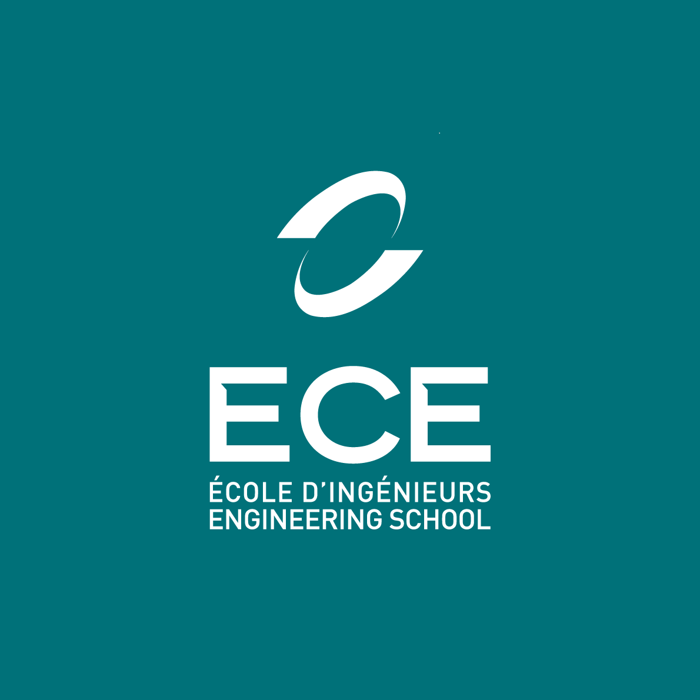

**ING1** Projet d'informatique


# ECE World

Equipe 5

---

# Equipe 5


- Sacha Girszyn
- Julien Kringel
- Léonard Brault
- Zeyna Tschayen
- Thomas Boures

---


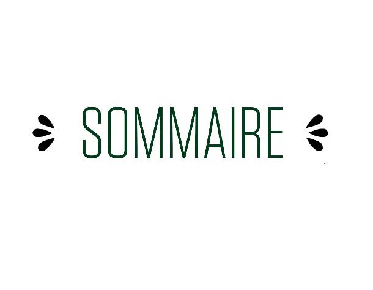

1- ECE WORLD
2- Carte
3- Course de vaisseaux
4- Jackpot
5- Jeu de la taupe
6- Tire aux ballons
7- Pêche aux canards

---

# ECE World

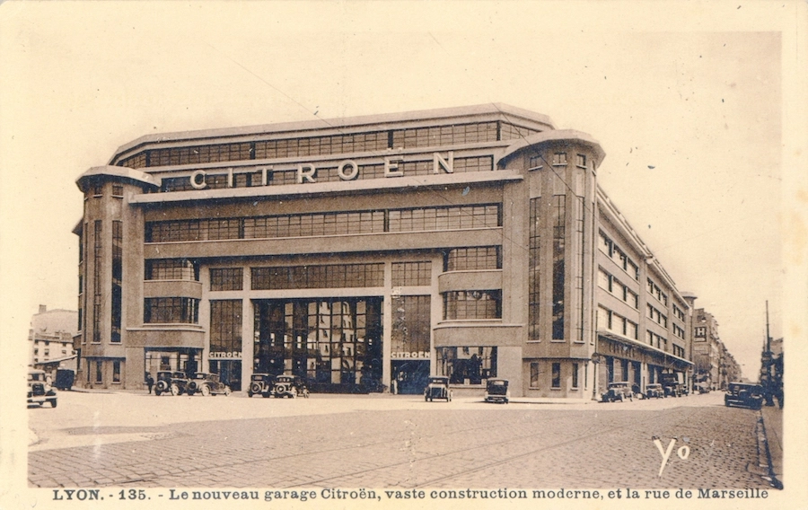

## Thème : The Universe Park

Bienvenue dans notre parc d'attractions interplanétaires. Montez à bord de notre vaisseau et dirigez vers la planète de votre choix pour participer à nos jeux.

---

# Carte `1/2`

*Réalisée par : **Sacha**.*

J'ai réussi à faire la map, c'est-à-dire l'écran d'accueil, l'affichage et le déplacement du vaisseau,l'affichage des planètes qui correspondent à des jeux du parc d'attractions.

**DTI de la carte:**

* Données: Matrice Tableau de 5lignes par 1à colonnes, screen de 800 par 600, la BITMAP des planètes, la BITMAP du vaisseau, la BITMAP du trou noir
* Traitements: Affichage du vaisseau et des planètes, Déplacement du vaisseau et porte de sortie du parc d'attractions
* Interfaces: Affichage sur l'écran et accessibilité au jeu selon la position du vaisseau, Déplacement du vaisseau par les flèches du clavier


--- 

# Carte `2/2`

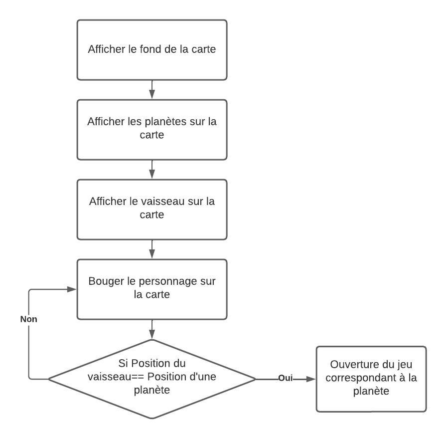


ACD:

* Tâches: Affichage de la carte, Affichage du vaisseau, Déplacement du Personnage, et Ouverture des jeux
* Décomposition: Récupération de la position des planètes et du vaisseau, Sauvegarde de la position après un jeu
* Décomposition des sous tâches: Demander à l'utilisateur de déplacer le vaisseau sur la planète de son choix


---

# Organisation des jeux
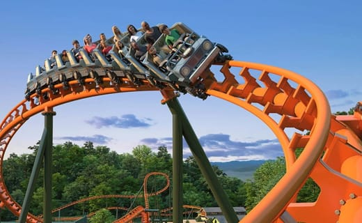


Chaque jeu correspond à une planète sur la carte.


Chaque jeu à son propre dossier avec son main.

Les jeux prennent souvent en paramètre les structures associées et  les bitmaps à afficher


---

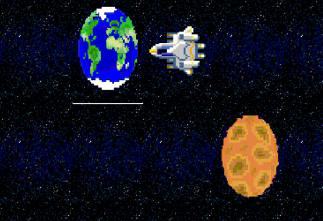


# Course des vaisseaux

*Réalisé par : **Sacha** (100%)

**Fonctionnement 1/5**

Le personnage rentre dans la planète. 


---

# Course des vaisseaux

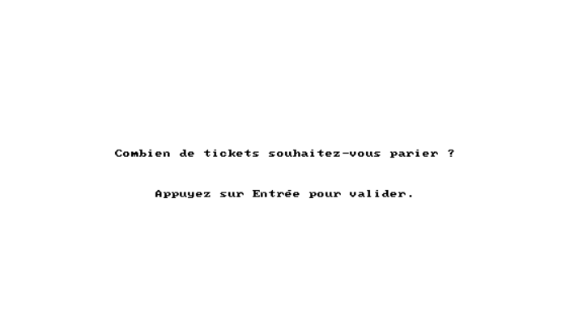

**Fonctionnement 2/5**

L'interface lui demande de parier sur un vaisseau :
* le nombre de tickets misés
* choix du vaisseau spatiale vainqueur


---

# Course des vaisseaux

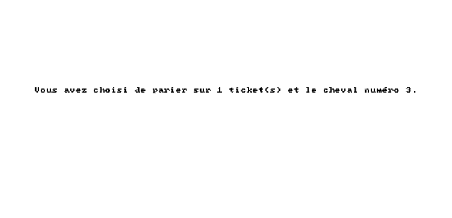

**Fonctionnement 3/5**

Le personnage rentre dans la planète. 

L'interface lui rappel son pari :
* le nombre de tickets misés
* choix du vaisseau spatiale vainqueur


---

# Course des vaisseaux

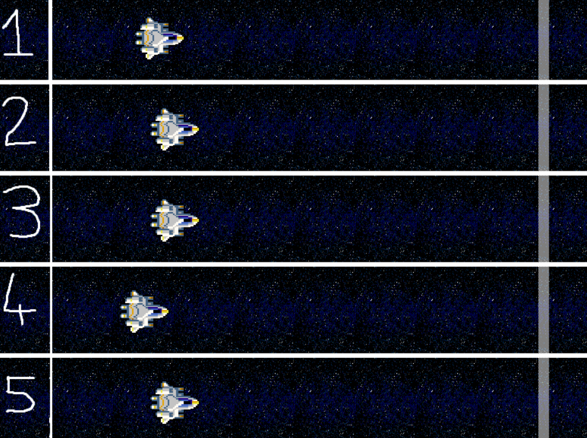

**Fonctionnement 4/5**

La course est lancée !

---

# Course des vaisseaux

**Fonctionnement 5/5**

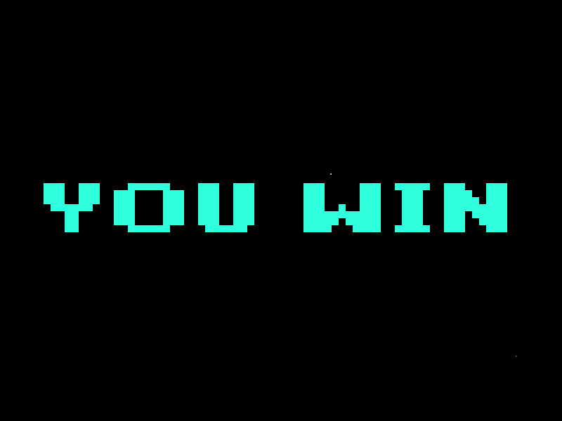
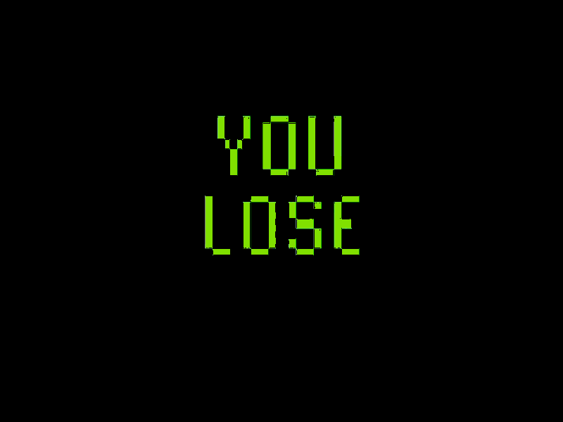


Selon le vaisseau qui gagne la course, l'interface annonce au joueur si il a gagné ou perdu.

---

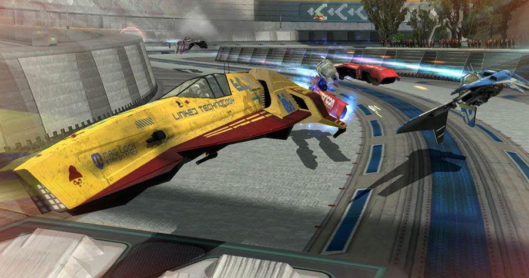

# Course des vaisseaux

### Structures
J'ai utilisé principalement une structure : Personnage avec les paramètres suivants :
* des images :  spriteGauche, spriteDroite, spriteHaut, spriteBAS
* des variables integer :  x, y, vitesse, offset, DirectionActuelle

<div class="mermaid">
%%{init: {'theme':'neutral'}}%%
classDiagram
   struct Personnage{
    BITMAP* spriteGauche;
    BITMAP* spriteDroite;
    BITMAP* spriteHaut;
    BITMAP* spriteBAS;
    int x;
    int y;
    int vitesse;
    int offset;
    int DirectionActuelle;
};
</div>

---


# Course des vaisseaux

### Tableaux

J'ai utilisé un tableau pour diviser la carte en zones
- int tab[5][10]

### Fonctions


CreerMatriceJeu()->demandeParier(); 
AfficherBackgroundJeu()->DeplacementVaisseau()
AfficherPersonnage()->AssignerVitesse
DeplacementVaisseaux()->AfficherImage()

---

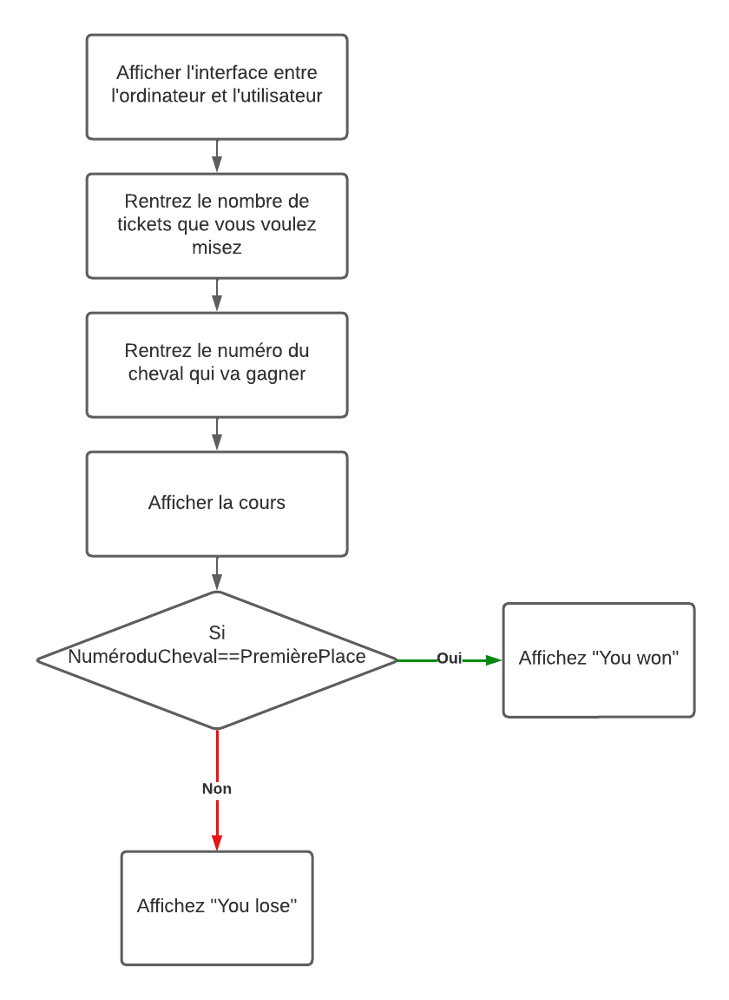

# Course des vaisseaux

### Logigramme


---


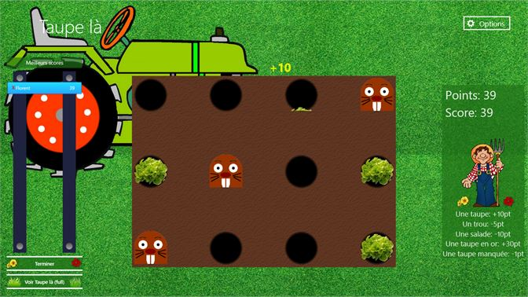

# Jeu de la Taupe

*Réalisé par : **Thomas** (100%)*

Ce jeu est une version informatisée du populaire jeu d'arcade. Le jeu consiste à faire apparaitre un certain nombre de "castors" à des positions aléatoires sur l'écran.

Le joueur doit cliquer sur les castors avant qu'ils ne disparaissent pour marquer des points.

---


# Jeu de la Taupe

**Voici une description plus détaillée du déroulement du jeu :**

Le jeu commence par demander aux joueurs de saisir leurs noms.
Ensuite, le générateur de nombres aléatoires est initialisé pour s'assurer que les positions des castors sont différentes à chaque partie.
Les images nécessaires au jeu (sprites) sont chargées à partir de fichiers spécifiés.
Une boucle principale de jeu est lancée, durant laquelle le jeu vérifie constamment si l'utilisateur a cliqué sur un castor.
Si c'est le cas, le joueur marque un point et le castor est réinitialisé à une autre position aléatoire.
Le score des joueurs et le joueur actif sont affichés à l'écran tout au long de la partie.
Si un joueur atteint un score de 25, il est déclaré gagnant et un écran de fin de jeu est affiché, annonçant le vainqueur.
Le jeu se termine soit lorsqu'un joueur atteint un score de 25, soit lorsque l'utilisateur appuie sur la touche 'Esc' pour quitter.


---


# Jeu de la Taupe

**Objectifs Réussis**

1.	Structure du jeu : Le jeu a été codé avec succès avec la logique de base du jeu . Cela comprend l'apparition aléatoire des castors, le score des joueurs et le changement de joueur actif.

2.	Interactions utilisateurs : Les joueurs peuvent entrer leurs noms, et interagir avec le jeu via la souris pour marquer des points.

3.	Condition de victoire : Lorsqu'un joueur atteint un score de 25, le jeu se termine avec un écran annonçant le vainqueur.


---


# Jeu de la Taupe

**Défis Non Résolus**

1.	Problèmes de rendu Allegro : Malgré l'implémentation réussie de la logique du jeu, je n'ai pas réussi à afficher correctement la fenêtre de jeu Allegro. Cela pourrait être dû à une mauvaise configuration de l'environnement Allegro.
2.	Chargement des images : Le principal problème rencontré était le chargement des images pour les sprites et l'arrière-plan. Le programme rencontre des erreurs lors de la tentative de chargement des images à partir des chemins spécifiés. La raison de ces erreurs n'est pas claire pour le moment.

---


# Jeu de la Taupe

**Prochaines Étapes**

•	Débogage de l'erreur de chargement des images : Il est nécessaire de résoudre le problème de chargement des images pour que le jeu puisse fonctionner comme prévu. Des tests supplémentaires et une vérification des chemins d'accès aux images sont nécessaires pour résoudre ce problème.

•	Optimisation de la performance : Une fois le problème des images résolu, l'étape suivante consistera à améliorer la performance du jeu, notamment en optimisant la génération aléatoire des castors et en rendant le jeu plus réactif.


---

# Logigramme

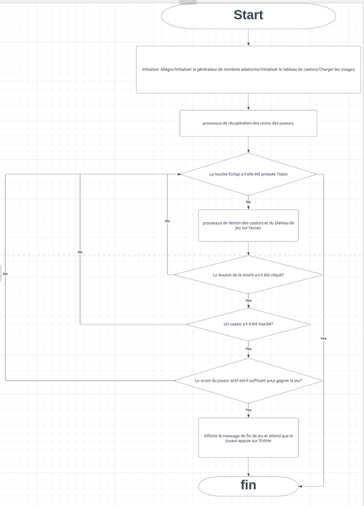


---

---


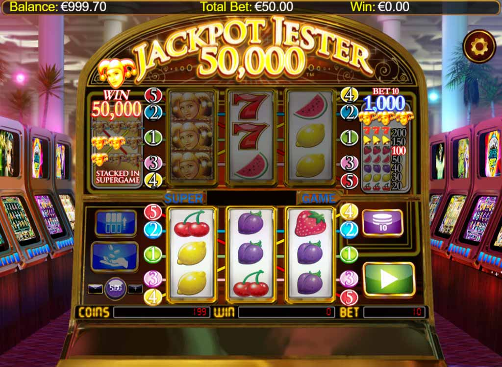

# Jeu du JackPot

*Réalisé par : **Zeyna** (100%)*

Le **jackpot** et un jeux qui se joue sur une machine. On active la machine et espère qu'elle tombe sur une combinaison (trois fois le meme symbole) gagante.

---


# Jeu du JackPot

**Difficulté rencontrée :**

L'ordinateur utilisé pour coder le jeu n'arrivait  pas a  suporter allegro

Il gelait si le programme était lancé (j'ai des preuves si nécéssaire). Donc impossibilité de tester le programme pour voir ce qui ne fonctionne pas et de le corriger.


---

# Logigramme

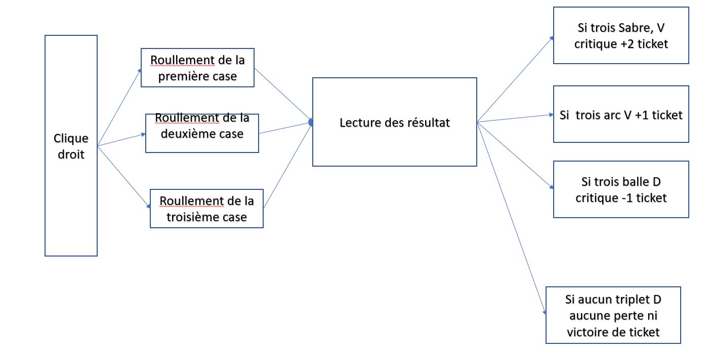


---


---


# Pêche aux canards

Pour chaque jeu (bien détailler au moins un jeu par personne), précisez les structures de données (structures importantes, tableaux importants, listes chainées...) et les fonctions importantes (avec leur prototype).

### Structures

<div class="mermaid">
%%{init: {'theme':'neutral'}}%%
classDiagram
    class Canard
    Canard : int x, y
    Canard : int vitesse
    class Canne
    Canne : int x, y
    Canne : Canard* canard
</div>

### Tableaux

- `Canard canards[20]`

---


# Pêche aux canards

### Graphe d'appel

<br>

<div class="mermaid">
%%{init: {'theme':'neutral'}}%%
flowchart LR
    pecheAuxCanards --> initialiserCanards
    initialiserCanards --> positionnerCanard
    pecheAuxCanards --> deplacerCanards
    deplacerCanards --> deplacerCanard
    pecheAuxCanards --> detecterCollisionCanards
</div>


---


# Pêche aux canards

### Logigramme

Que vous jugez pertinent (image ou Mermaid.js)


---


# Bilan collectif


---

<!--
_class: lead
-->

# Les slides suivantes ne seront pas présentées oralement lors de la soutenance mais doivent figurer dans la présentation. Nous les survolerons rapidement.

---

# Répartition des taches du projet

## Tâches réalisées (pour chaque membre de l'équipe)

- `✅ 100%` Tâche 1 : Par Sacha :  La carte et son fonctionnement.

- `✅ 100%` Tâche 2 : Par Sacha : Le jeu de la course des vaisseaux

- `❌ 70%` Tâche 3 : Par Leonard : La peche aux canards

- `❌ 60%` Tâche 4 : Par Zeyna : Le jackpot


---

# Répartition des taches du projet

## Tâches réalisées (pour chaque membre de l'équipe)

- `❌ 80%` Tâche 5 : Par Thomas : Le jeu de la taupe

- `❌ 70%` Tâche 6 : Par Julien : Le tir aux ballons

- `✅ 100%` Tâche 7 : Par Sacha : Regroupement des codes et de la présentation dans Marp

**Pour les taches 3 à 6 : Nous n'avons pas réussi à compiler le code après avoir regroupé les 5 jeux.**

---

# Investissement

| Membre | Répartition | Tâches réalisées | 
| --- | --- | --- |
| Sacha | 32% | Carte + Jeu + Coordination |
| Leonard | 17 | Jeu |
| Zeyna | 17% | Jeu |
| Julien | 17% | Jeu |
| Thomas | 17% | Jeu |

---

# Récapitulatif des jeux

| Jeu | Avancement | Problèmes / reste |
| --- | --- | --- |
| Course des vaisseaux | 95% | Sauvegarde des tickets gagnés ou perdus. |
| Peche aux canards | 70% | Problème de code |
| Jackpot | 60% | Problème de code |
| Jeu de la taupe | 80% | Problème de code |
| Tir aux ballons | 70% | Problème d'affichage |

---

<!--
_class: lead
-->
# Quelques éléments que vous pouvez utiliser à votre guise dans votre présentation

---

# Schémas et Graphes

Vous pouvez utiliser [Mermaid.js](https://mermaid.js.org/) pour générer des schémas. Regardez la documentation.

---

# Slide avec du code


```C
for(int i = 0; i < 5; i++) {
    printf("%d ", i);
}
```

> 0 1 2 3 4 


---

# Emojis

https://gist.github.com/rxaviers/7360908

---

# Thème 

Vous pouvez personnaliser l'affichage de votre présentation avec le langage CSS en modifiant le fichier `theme.css`.

---

# Export PDF

Depuis récemment, l'export (**`Export Slide Deck...`**) en PDF oublie parfois des éléments. 
Si c'est le cas, nous vous conseillons d'exporter en fichier PowerPoint (pptx), puis de l'exporter en PDF depuis PowerPoint.